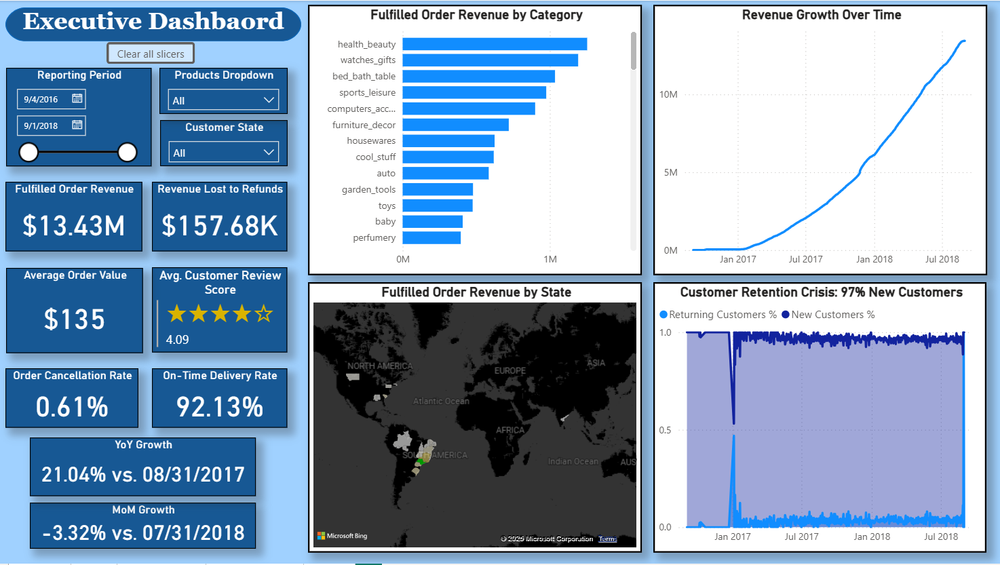

1. **Dashboard Summary**
	**Executive Dashboard**
	
	The Executive Dashboard provides a high-level strategic overview of the platform's performance, designed for C-suite decision-making. Key metrics include:
	- **Financial Performance**: Fulfilled order revenue of $13.43M against refunds of $157.68K, demonstrating strong revenue retention
	- **Operational Excellence**: 92.13% on-time delivery rate and minimal 0.61% order cancellation rate showcase operational efficiency
	- **Customer Satisfaction**: Average review score of 4.09/5.0 indicates solid product and service quality
	- **Geographic Distribution**: Visual mapping reveals market presence across multiple regions, with concentration patterns that inform expansion strategies
	- **Growth Trajectory**: Revenue growth chart shows clear upward momentum, while the customer retention analysis highlights a critical area requiring strategic intervention (97% new customers)
	- **Temporal Controls**: Date range slicing (9/4/2016 - 9/1/2018) and state/product filters enable executive-level drill-down analysis
	
	**Sales Dashboard**
	The Sales Dashboard delivers deeper analytical insights into marketplace dynamics and relationship patterns: