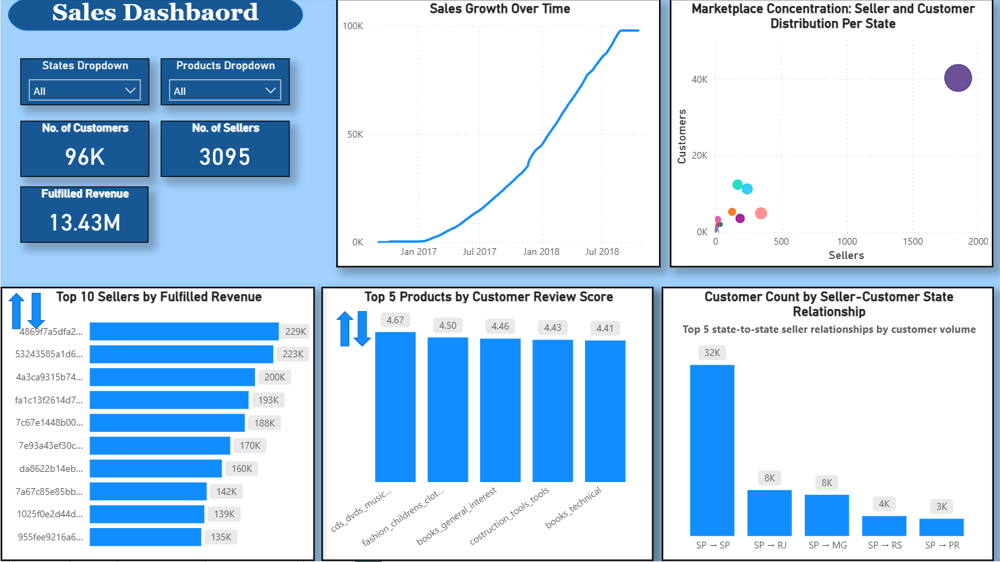
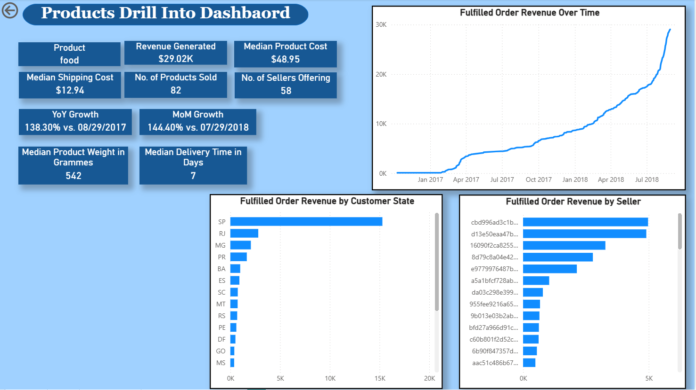

1. **Dashboard Summary**
	**Executive Dashboard**
	
	
	The Executive Dashboard provides a high-level strategic overview of the platform's performance, designed for C-suite decision-making. Key metrics include:
	- **Financial Performance**: Fulfilled order revenue of $13.43M against refunds of $157.68K, demonstrating strong revenue retention
	- **Operational Excellence**: 92.13% on-time delivery rate and minimal 0.61% order cancellation rate showcase operational efficiency
	- **Customer Satisfaction**: Average review score of 4.09/5.0 indicates solid product and service quality
	- **Geographic Distribution**: Visual mapping reveals market presence across multiple regions, with concentration patterns that inform expansion strategies
	- **Growth Trajectory**: Revenue growth chart shows clear upward momentum, while the customer retention analysis highlights a critical area requiring strategic intervention (97% new customers)
	- **Temporal Controls**: Date range slicing (9/4/2016 - 9/1/2018) and state/product filters enable executive-level drill-down analysis
	
	**Sales Dashboard**
	
	
	The Sales Dashboard delivers deeper analytical insights into marketplace dynamics and relationship patterns:
	- **Market Scale**: 96K customers and 3,095 sellers, generating $13.43M in fulfilled revenue
	- **Seller-Customer Correlation**: The concentration scatter plot reveals a positive relationship between seller density and customer volume, indicating healthy marketplace effects
	- **State-to-State Trade Flows**: The relationship analysis shows SP → SP dominates with 32K customer connections, followed by SP → RJ (8K) and SP → MG (8K), revealing intra-state and interstate commerce patterns
	- **Product Performance Rankings**: Identifies top-performing product categories by customer review scores (CDs, audio, music at 4.67) and top sellers by revenue
	- **Growth Visualization**: Sales growth chart demonstrates consistent upward trajectory, validating marketplace expansion efforts
	- **Interactive Navigation**: Filter controls enable dynamic analysis by state and product categories
	
	**Sellers Drill-Into Dashboard**
	
	
	This drill-through page enables granular seller-level analysis, accessible via the Sales Dashboard through top/bottom 10 rankings or filtered selections:
	- **Navigation Design**: Bookmark-enabled toggle arrows allow switching between top-performing and underperforming sellers
	- **Seller Profile Metrics**: Displays comprehensive seller KPIs including customer count, order volume, revenue generation, and average order value
	- **Performance Benchmarking**: YoY and MoM growth metrics enable performance trending and comparison
	- **Order Fulfillment Analysis**: Order status distribution reveals operational efficiency (99.29% delivered rate)
	- **Geographic Reach**: Customer state distribution shows market penetration patterns
	- **Product Mix**: Revenue breakdown by product category reveals seller specialization
	- **Context Preservation**: State/product filters from Sales Dashboard carry through for contextual analysis

	**Products Drill-Into Dashboard**
	
	This analytical view enables product-level deep dives, designed to drill from Executive Dashboard product categories:
	- **Product Economics**: Reveals median cost ($48.95), shipping cost ($12.94), and revenue generated ($29.02K) for category "food"
	- **Market Coverage**: Number of sellers offering (58) and products sold (82) indicate market supply dynamics
	- **Logistics Metrics**: Median delivery time (7 days) and product weight (542g) inform operational planning
	- **Growth Analysis**: Strong YoY (138.30%) and MoM (144.40%) growth metrics highlight category momentum
	- **Geographic Revenue Distribution**: State-level breakdown shows revenue concentration patterns
	- **Seller Performance**: Revenue by seller visualization identifies key suppliers and partnership opportunities
	
2. **Key Insights & Findings**
	**Revenue Performance & Growth Dynamics**
		**Strong Revenue Growth with Accelerating Momentum**: The platform demonstrates consistent upward revenue trajectory across all dashboards, reaching $13.43M in fulfilled orders. However, the cumulative nature of the growth chart masks important rate-of-change insights. YoY growth of 21.04% (vs. 08/31/2017) paired with negative MoM growth of -3.32% (vs. 07/31/2018) on the Executive Dashboard suggests potential seasonal fluctuations or market saturation in specific segments. The individual seller and product drill-downs show more dramatic growth rates (52.40% YoY and 138.30% YoY respectively), indicating performance variance across the marketplace. **Recommendation**: Implement more granular period-over-period analysis using the YoY and MoM metrics to identify declining growth rates early and adjust marketing/expansion strategies accordingly.
		
	**Critical Customer Retention Challenge**
		**Customer Retention Crisis Demands Immediate Strategic Response**: The platform faces a severe retention problem with 97% of revenue coming from new customers, as highlighted in the Executive Dashboard's customer retention analysis. This indicates a transactional marketplace rather than a loyal customer ecosystem. The sharp drop from returning to new customers in early 2017 suggests a structural issue with post-purchase engagement, customer experience, or competitive retention. With an average order value of only $135 and minimal repeat purchases, customer lifetime value remains severely constrained. **Recommendation**: Implement a comprehensive retention strategy including loyalty programs, personalized marketing campaigns, post-purchase engagement sequences, and proactive customer success interventions to shift the retention curve toward recurring revenue.
		
	 **Geographic Market Concentration & Expansion Opportunity**
		**State SP Dominance Presents Both Strength and Risk**: The marketplace exhibits extreme geographic concentration, with state SP accounting for the majority of both sellers and customers, as evidenced across multiple dashboards. The Sales Dashboard reveals that SP → SP intra-state transactions generate 32K customer relationships—four times the volume of the next relationship (SP → RJ at 8K). The scatter plot visualization demonstrates a positive correlation between seller density and customer volume, suggesting network effects are functioning properly. However, this concentration creates strategic vulnerability to regional economic shocks and regulatory changes. **Recommendation**: Leverage the proven seller-customer correlation to systematically expand into underrepresented states by recruiting sellers in target regions and implementing localized marketing campaigns to bootstrap similar network effects in new geographic markets.
		
	**Operational Excellence Foundation**
		**Strong Operational Metrics Provide Competitive Advantage**: The platform demonstrates operational excellence across multiple dimensions: 92.13% on-time delivery rate significantly exceeds industry standards, 0.61% order cancellation rate indicates reliable fulfillment, and 4.09/5.0 average customer review score reflects overall satisfaction. Individual seller analysis shows 99.29% delivered orders, confirming consistent performance across the seller base. The median delivery time of 7 days for products like food demonstrates competitive logistics capability. **Strategic Value**: These operational strengths provide a solid foundation for growth initiatives and should be prominently featured in both customer acquisition and seller recruitment messaging to differentiate from competitors.
	
	**Seller Performance Distribution & Partnership Strategy**
		**Top Seller Concentration Requires Risk Management and Ecosystem Development**: The Sales Dashboard reveals significant revenue concentration among top sellers, with the #1 seller generating $229K compared to #10 at $135K. This 70% variance indicates an uneven marketplace where a small number of power sellers drive disproportionate revenue. The seller count of 3,095 serving 96K customers suggests a healthy 31:1 customer-to-seller ratio overall, but the top 10 sellers likely capture an outsized market share. Individual seller analysis shows the top performer serves 1,124 customers with an impressive $202.51 average order value. **Recommendation**: Balance seller ecosystem development by implementing tiered support programs—maintain high-touch relationships with power sellers to prevent attrition while creating growth pathways for mid-tier sellers through educational resources, marketing co-op programs, and featured placement opportunities.